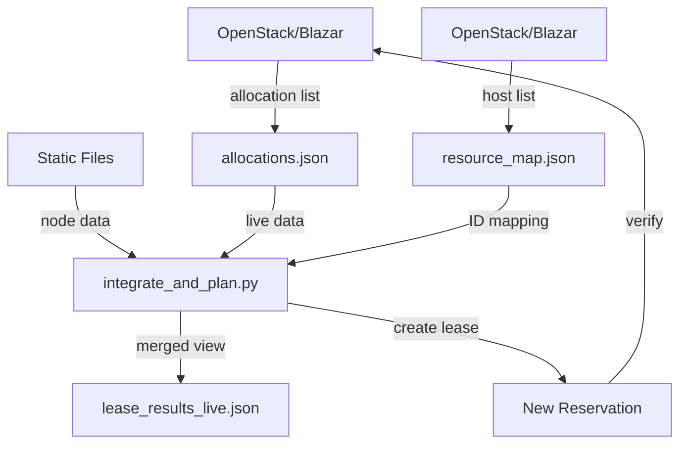

# ENVBoot Live Reservation Pipeline Guide

## 1. Overview

The ENVBoot reservation pipeline solves a critical challenge in large-scale compute environments: efficiently mapping live resource availability to static infrastructure data. This system bridges the gap between OpenStack/Blazar's real-time allocation data and Chameleon's static node inventory, enabling both manual and automated lease creation.

### Core Functions
- Combines live OpenStack allocations with static node inventory
- Maps Blazar resource IDs to actual compute nodes
- Validates resource availability for specific time windows
- Automates lease creation with verification
- Maintains audit trails of resource reservations

### Role in ENVBoot Workflow
This pipeline is central to ENVBoot's resource management:
- **Base Case**: Direct resource acquisition when capacity exists
- **Limited Resources**: Fallback to alternative zones or time windows
- **Downgrade Scenarios**: Adapting resource requests based on availability
- **Automated Planning**: AI-driven resource selection and reservation

## 2. Components and Data Files

### 2.1 Live Allocation Data
**allocations.json**
```bash
# Generated via:
openstack reservation allocation list host -f json > allocations.json
```
Contains current Blazar allocations:
```json
[
  {
    "resource_id": "1234",
    "reservations": [
      {
        "lease_id": "abcd-1234",
        "start_date": "2025-10-26T14:00:00.000000",
        "end_date": "2025-10-26T18:00:00.000000"
      }
    ]
  }
]
```

### 2.2 Static Infrastructure Files

**uc_chameleon_nodes.json**
- Node inventory with physical details
```json
{
  "items": [
    {
      "uid": "node-uuid-123",
      "node_name": "gpu01.example.edu",
      "cluster": "gpu-cluster"
    }
  ]
}
```

**uc_clusters.json**
- Cluster metadata and capabilities
```json
{
  "items": [
    {
      "uid": "gpu-cluster",
      "name": "GPU Compute Cluster",
      "flavor_info": {
        "gpus": 4,
        "vcpus": 48
      }
    }
  ]
}
```

**sites.json**
- Site-level organization
```json
{
  "items": [
    {
      "uid": "uc",
      "name": "University of Chicago",
      "clusters": ["gpu-cluster", "cpu-cluster"]
    }
  ]
}
```

### 2.3 Resource Mapping

**resource_map.json**
```bash
# Generated via:
openstack reservation host list -f json > hosts.json
jq 'map({(.id): .hypervisor_hostname}) | add' hosts.json > resource_map.json
```
Maps Blazar IDs to nodes:
```json
{
  "1234": "gpu01.example.edu",
  "5678": "node-uuid-123"
}
```

### 2.4 Merged Output

**lease_results_live.json**
- Generated by joining all above data
- Hierarchical structure: sites → clusters → nodes
- Each node includes current reservations
```json
{
  "site_summaries": [{
    "site_id": "uc",
    "clusters": [{
      "cluster_id": "gpu-cluster",
      "nodes": [{
        "node_uuid": "node-uuid-123",
        "hostname": "gpu01.example.edu",
        "resource_id": "1234",
        "reservations": [...]
      }]
    }]
  }],
  "unmatched_allocations": []
}
```

## 3. integrate_and_plan.py

### 3.1 Purpose
Primary script for availability checking and lease creation, combining all data sources into a unified view.

### 3.2 Configuration
```bash
# Command line arguments
--refresh            # Pull fresh allocations from OpenStack
--zone              # Target zone (default: current)
--start             # Lease start time (YYYY-MM-DD HH:MM)
--duration          # Duration in minutes
--resource-type     # physical:host or flavor:instance
--amount            # Number of resources to reserve
--dry-run          # 1 for testing, 0 to create lease

# Environment variables (alternative)
export ZONE="current"
export DESIRED_START="2025-10-26 14:00"
export DURATION_MIN="120"
export RESOURCE_TYPE="physical:host"
export AMOUNT="1"
export DRY_RUN="1"
```

### 3.3 Internal Flow
1. **Data Refresh** (optional)
   - Updates allocations.json from OpenStack
   - Validates JSON format

2. **Data Loading**
   - Reads all input files with error handling
   - Validates required fields

3. **Node Mapping**
   - Builds node_map (UUID → info)
   - Creates zone_map (UUID → zone)
   - Uses resource_map.json for ID translation

4. **Availability Check**
   - Normalizes time formats
   - Checks for reservation overlaps
   - Identifies free nodes in target zone

5. **Lease Creation** (if dry-run=0)
   - Creates lease via Blazar API
   - Records action in reserve_audit.jsonl
   - Verifies lease creation

## 4. Lease Creation and Validation

### 4.1 Creation Methods

**Via OpenStack CLI:**
```bash
openstack reservation lease create \
  --name "envboot-auto-20251026-140000" \
  --start-date "2025-10-26 14:00" \
  --end-date "2025-10-26 16:00" \
  --reservation "resource_type=physical:host,min=1,max=1"
```

**Via Blazar API (in code):**
```python
from envboot.osutil import blz

lease = blz().lease.create(
    name=name,
    start=start_str,
    end=end_str,
    reservations=[{
        "resource_type": resource_type,
        "min": amount,
        "max": amount,
        "resource_properties": "[]",
        "hypervisor_properties": "[]"
    }],
    events=[]
)
```

### 4.2 Validation Flow
1. Create lease → get lease_id
2. Refresh allocations.json
3. Regenerate lease_results_live.json
4. Verify lease appears in output
5. Record in reserve_audit.jsonl

## 5. End-to-End Flow



Key Features:
- Real-time availability tracking
- Automated lease creation
- Audit trail maintenance
- Verification pipeline

## 6. References

### Related Scripts
- **cli.py**: Main ENVBoot CLI interface
  - Can invoke integrate_and_plan.py functionality
  - Handles authentication and session management

- **api_live.py**: Core API integration
  - Handles Blazar API communication
  - Provides resource mapping utilities

### Repository Structure
```
ENVBoot/
├── integrate_and_plan.py    # Main reservation script
├── envboot/
│   ├── cli.py              # CLI interface
│   ├── api_live.py         # API utilities
│   └── osutil.py           # OpenStack helpers
├── examples/
│   └── api_samples/        # Static data files
└── results/
    └── lease_results_live.json
```

### Quick Start
```bash
# 1. Set up environment
source .venv/bin/activate
source CHI-251467-openrc.sh

# 2. Check availability
./integrate_and_plan.py --start "2025-10-26 14:00"

# 3. Create lease
./integrate_and_plan.py --start "2025-10-26 14:00" --dry-run 0
```

This pipeline provides a robust foundation for both manual and automated resource management in the ENVBoot system, enabling efficient scheduling and utilization of compute resources.